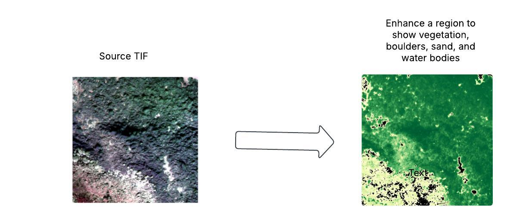

TIF files for multiband signals can be tranformed via various indices (such as NDVI) to reveal vegetation, boulders, sand and water bodies. 

```
python -m main.main ../dataset/test/tif/small_block.tif
```



